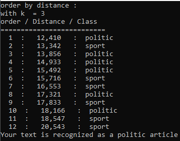

# text_classification_knn
#### in this project , i implemented KNN (K-Nearest-Neighbors) algorithm to classify our article as either political article or a sports article
#### and the idea here is to classify our unclassified input article based on similiarity measure (distance functions) to determine the closest neighbors( depends on k value )

